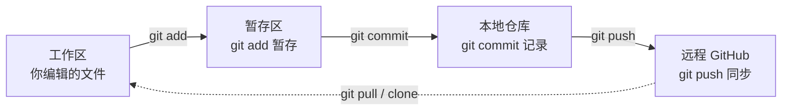

Git 是现在写代码、写博客几乎一定会碰到的工具。它本质上是一个**版本控制系统**——帮你记录每一次改动、随时回退、和远程仓库同步。这篇文章不讲晦涩原理，只给你**能直接照抄用起来**的那部分。

## 核心模型：四个区域 + 四条命令

理解 git 只需要记住一张图。你的文件会在四个区域之间流动：



| 区域 | 你该怎么理解 |
|---|---|
| **工作区 Working Directory** | 你直接编辑的文件，改了但 git 还没"接管" |
| **暂存区 Staging** | `git add` 后，把"这次想提交哪些改动"先列出来 |
| **本地仓库 Local Repo** | `git commit` 后，改动被永久记录成一个"版本节点" |
| **远程仓库 Remote** | GitHub 上的仓库，`git push` 上传、`git pull` 拉回 |

记住这条线：**status 看 → add 选 → commit 存 → push 传**。后面所有操作都不会乱。

## 首次配置：设置身份（只做一次）

Git 每次提交都要署名。第一次使用先设好（把引号里换成你自己的）：

```bash
git config --global user.name "sadsnowcat"
git config --global user.email "你的邮箱@xxx.com"
```

`--global` 表示这台机器所有仓库通用。在 WSL 里使用，就在 WSL 的终端里设，不是 Windows 的 Git Bash。

## 最常用命令

按日常使用顺序排列：

**1. `git status` — 先看现在什么状态**
最重要的命令。告诉你哪些文件改了、哪些进了暂存区。每次提交前都先敲它。

**2. `git add <文件>` — 把改动放进暂存区**

```bash
git add .gitignore     # 只加这一个文件
git add .              # 加当前目录所有改动（方便但粗放）
```

**3. `git commit -m "说明文字"` — 提交到本地仓库**
`-m` 后面写这次干了啥，**务必写清楚**：

```bash
git commit -m "chore: add gitignore for astro + vercel"
```

**4. `git push` — 推到 GitHub**

```bash
git push -u origin main   # 首次推送某分支用 -u 记住 upstream
git push                  # 之后直接 push 即可
```

**5. `git pull` — 拉取远程更新**
别人改了或换设备改了，先 `pull` 再 `push`，避免冲突。

**6. `git log --oneline` — 看历史**
一行一条，快速回顾提交记录。

查看具体改动：`git diff` 看工作区 vs 暂存区的差异；`git diff --staged` 看暂存区 vs 上次提交。

## 实战：把博客推上 GitHub + Vercel

我的博客基于 astro-navfolio，部署方式是 **GitHub 仓库 + Vercel**。完整流程如下（在 WSL 中操作）：

```bash
# 1. 进入项目
cd ~/astro-navfolio

# 2. 看状态
git status

# 3. 看远程指向哪（关键！）
git remote -v
```

如果 `git remote -v` 显示的是**模板原作者的仓库**，你不能往那推。先在 GitHub 新建一个自己的空仓库，然后改远程：

```bash
git remote set-url origin https://github.com/sadsnowcat/你的仓库名.git
```

如果已经是你自己的仓库，直接往下走：

```bash
git add .gitignore        # 把刚改的加进去（或 git add . 一次性）
git commit -m "chore: add gitignore for astro + vercel"
git push -u origin main
```

推上去之后，Vercel 连着这个 GitHub 仓库，**每次 push 会自动重新构建部署**，你不用在 Vercel 点任何东西。

> 关于 `.gitignore`：部署到 Vercel 只需忽略依赖、构建产物、缓存、密钥和系统文件。`dist/`、`.astro/`、`.vercel/`、`node_modules/`、`.env*` 都要忽略；锁文件（如 `bun.lockb`）反而要提交，让 Vercel 复现一致的依赖版本。

## 分支简介

默认分支通常叫 `main`（老仓库叫 `master`）。一个人写博客，**一直用 main 就够了**，不用折腾分支。

想试新功能又不破坏主线时：

```bash
git checkout -b 新功能名    # 开个分支
# ... 改完 ...
git checkout main           # 回到主线
git merge 新功能名          # 合并回来
```

查看分支：`git branch`。

## 常见坑

1. **忘了 `git add` 就 `commit`** → 文件没进提交。习惯流程：`status → add → commit → push`，status 反复确认。
2. **把 `.env` 提交上去** → 密钥泄露。用 `.gitignore` 把 `.env*` 全屏蔽。
3. **提交信息写 `"update"`/`"fix"`** → 三个月后自己都看不懂。写"改了什么 + 为什么"。
4. **本地没 `pull` 就 `push`** → 远程有别人的新提交会冲突。push 前先 `pull`。
5. **误删文件想找回** → `git log` 找到那次提交，`git checkout <commit> -- 文件名` 即可恢复。这是 git 最大的价值：永远能回退。

## 速记口诀

> **status 看 → add 选 → commit 存 → push 传**

记住这条线，git 就够你用一辈子了。
